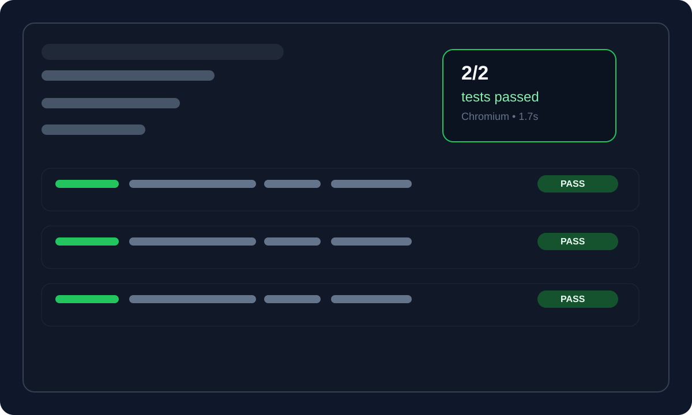

# Playwright Framework Demo

[](https://github.com/lramac3/playwright-framework-demo/actions/workflows/playwright.yml)

This project demonstrates a pragmatic Playwright setup that mirrors a real-world workflow: helper-driven browser actions, selective fixtures for authenticated scenarios, imperative `beforeEach` setup, and CI sharding for faster feedback. These are the patterns I run in production — a nightly suite where this structure cut runtime ~70% and stabilized pass rates at 95%+.

## What it covers

- TypeScript-based Playwright tests
- Tiered tagging with `@smoke` and `@regression`
- Per-worker parallelism for local runs
- Reusable storage-state auth against SauceDemo
- Docker support for reproducible runs
- GitHub Actions workflow with sharded matrix jobs

## Architecture

- `tests/helpers/` contains reusable browser helpers such as login, inventory navigation, and cart actions.
- `tests/fixtures/` provides selective fixtures for authenticated pages and app helpers.
- `tests/` holds smoke and regression specs, which keep the setup logic close to the behavior under test.
- `playwright.config.ts` centralizes browser settings, parallelism, and reporting.

## Quick start

```bash
npm install
npx playwright install chromium
npm run test:smoke
```

## CI

The GitHub Actions workflow runs smoke and regression suites in sharded matrix jobs to keep execution fast and predictable.

### Passing-suite preview



This visual gives visitors a quick sense of the passing suite and the report structure without needing to run the tests locally.
